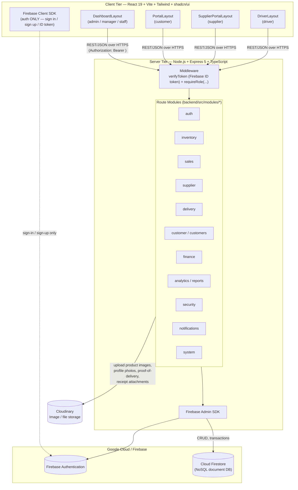
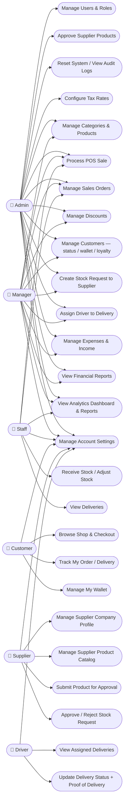
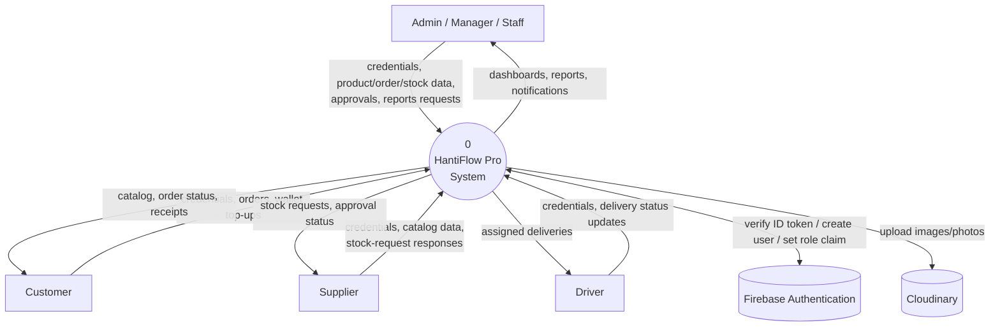
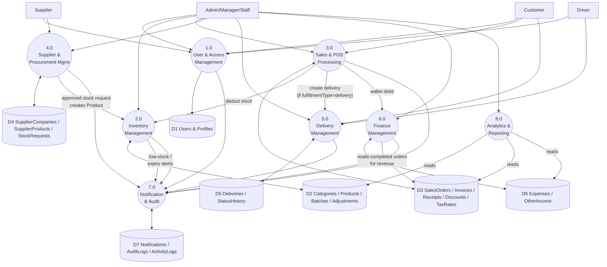

# HantiFlow Pro — System Design

This document is generated from the actual implemented system (not a pre-build plan), so every entity, route, and relationship below is traceable to a real file in this repository. File references are given so each diagram can be cited in the thesis text.

**How to use these diagrams in your thesis**: every diagram below is Mermaid code. To get them into a Word document as images:
1. Easiest: open this file in VS Code with the "Markdown Preview Mermaid Support" extension, or paste each code block into [mermaid.live](https://mermaid.live), then export as PNG/SVG and insert into Word as a figure.
2. Each diagram is preceded by a `### Figure X.Y` heading you can reuse as the figure caption.

---

## 1. User Roles

HantiFlow Pro has six roles, enforced on every backend route via `verifyToken` + `requireRole([...])` middleware (`backend/src/middleware/`):

| Role | Description |
|---|---|
| **admin** | Full system owner. Only role that can create/delete staff-side users, approve supplier-submitted products, configure tax rates, view audit/activity logs, and reset the system. |
| **manager** | Operational lead. Everything admin can do *except* user management, product approval, tax rate config, audit/activity logs, and system reset. |
| **staff** | Front-line worker. Can run POS sales, receive stock, adjust stock, and view (not create/edit) products/categories. |
| **customer** | End buyer, self-registered. Shops online, checks out, tracks delivery, manages their own wallet. |
| **supplier** | External vendor, account created by admin. Manages their own company profile and product catalog, submits products for approval, responds to stock requests. |
| **driver** | Delivery agent, account created by admin. Sees only their assigned deliveries and updates delivery status with proof-of-delivery. |

*Source: `backend/src/shared/types/auth.types.ts`, every `*.routes.ts` under `backend/src/modules/`.*

---

## 2. System Architecture Diagram

### Figure 2.1 — System Architecture



**Key architectural decision worth a paragraph in the thesis**: the frontend never talks to Firestore directly for business data — it only uses the Firebase Client SDK for the authentication handshake (sign-in/sign-up), then sends the resulting ID token as a Bearer header to the Express backend for every other operation. The backend is the single point of enforcement for RBAC (`requireRole`), data validation (Zod schemas), audit logging, and business rules (e.g. stock transactions). This "backend-mediated" pattern means the Firestore Security Rules (`firestore.rules`) can stay restrictive/closed, since clients have no direct read/write path to the database.

*Source: `backend/src/middleware/verifyToken.ts`, `backend/src/middleware/requireRole.ts`, `backend/src/config/firebase.ts`, `frontend/src/lib/firebase.ts`, `frontend/src/api/client.ts`.*

---

## 3. Use Case Diagram

> Mermaid has no native UML use-case notation (no actor stick-figures/ovals), so this is rendered as a flowchart: each actor is a rectangle, each use case is a rounded/stadium node. This is a standard, widely-accepted workaround for thesis diagrams when using Mermaid — if your rubric requires literal UML stick-figure notation, use this diagram's content as the spec and redraw it in draw.io/Lucidchart/Visio.

### Figure 3.1 — Use Case Diagram



*Source: role restrictions read directly from every `requireRole([...])` call across `backend/src/modules/**/*.routes.ts`.*

---

## 4. Data Flow Diagram

> Mermaid also has no dedicated DFD notation. Convention used below (standard Gane–Sarson style, redrawable in any DFD tool): **rectangle** = external entity, **circle** = process, **cylinder** = data store.

### Figure 4.1 — DFD Level 0 (Context Diagram)



### Figure 4.2 — DFD Level 1 (Process Decomposition)



*Source: derived from the cross-module calls documented in `backend/src/modules/inventory/stock.service.ts` (PO/stock-request fold-in), `backend/src/modules/sales/salesOrder.service.ts` (stock deduction, delivery + wallet creation), `backend/src/shared/utils/notifications.ts` and `auditLog.ts` (called from every module).*

---

## 5. Entity-Relationship Diagram

### Figure 5.1 — ER Diagram (Firestore data model)

```mermaid
erDiagram
    %% ===== Identity & Roles =====
    User ||--o| CustomerProfile : "has, if role=customer"
    User ||--o| SupplierProfile : "has, if role=supplier"
    User ||--o| DriverProfile : "has, if role=driver"
    User ||--o| StaffProfile : "has, if role=staff"

    %% ===== Inventory =====
    Category ||--o{ Category : "parentCategoryId (subcategory)"
    Category ||--o{ Product : "categoryId"
    TaxRate ||--o{ Product : "taxRateId"
    Product ||--o{ Batch : "productId"
    Product ||--o{ StockAdjustment : "productId"
    Batch ||--o{ StockAdjustment : "batchId"
    Product ||--o{ GoodsReceipt : "productId"
    Batch ||--o{ GoodsReceipt : "batchId"
    User ||--o{ StockAdjustment : "performedBy"
    User ||--o{ GoodsReceipt : "receivedBy"

    %% ===== Sales =====
    User ||--o{ SalesOrder : "createdBy (staff) / customerId"
    Product ||--o{ SalesOrder : "via items[].productId"
    SalesOrder ||--o{ Invoice : "salesOrderId"
    SalesOrder ||--o{ Receipt : "salesOrderId"
    Category ||--o{ Discount : "targetIds, if appliesTo=category"
    Product ||--o{ Discount : "targetIds, if appliesTo=product"

    %% ===== Delivery =====
    SalesOrder ||--o| Delivery : "salesOrderId"
    User ||--o{ Delivery : "customerId"
    User ||--o{ Delivery : "driverId"
    Delivery ||--o{ DeliveryStatusEvent : "subcollection statusHistory"
    User ||--o{ DeliveryStatusEvent : "updatedBy"

    %% ===== Finance / Wallet =====
    User ||--o{ WalletTransaction : "customerId"
    SalesOrder ||--o| WalletTransaction : "relatedOrderId"
    User ||--o{ Expense : "recordedBy"
    User ||--o{ OtherIncome : "recordedBy"

    %% ===== Supplier / Procurement =====
    User ||--o{ SupplierCompany : "supplierId"
    SupplierCompany ||--o{ SupplierProduct : "companyId"
    User ||--o{ SupplierProduct : "supplierId"
    SupplierProduct ||--o| Product : "linkedProductId, once submitted"
    SupplierProduct ||--o{ StockRequest : "supplierProductId"
    User ||--o{ StockRequest : "supplierId / requestedBy"
    StockRequest ||--o| Product : "resultingProductId"

    %% ===== Notifications & Logs =====
    User ||--o{ Notification : "userId"
    User ||--o{ AuditLog : "userId"
    User ||--o{ ActivityLog : "userId"

    User {
        string uid PK
        string email
        string username
        string displayName
        string role "admin|manager|staff|customer|supplier|driver"
        string status "active|suspended"
    }
    CustomerProfile {
        string uid PK_FK
        number walletBalance
        number loyaltyPoints
        Address_array addresses
    }
    SupplierProfile {
        string uid PK_FK
        string companyName
        number rating
    }
    DriverProfile {
        string uid PK_FK
        string vehicleType
        string status "available|on_delivery|offline"
    }
    StaffProfile {
        string uid PK_FK
        string employeeId
        string department
    }
    Category {
        string id PK
        string name
        string parentCategoryId FK
        boolean isActive
    }
    Product {
        string id PK
        string sku
        string barcode
        string categoryId FK
        string taxRateId FK
        number costPrice
        number sellingPrice
        number totalStock
        boolean isLowStock
        string approvalStatus "pending|approved"
        string supplierProductId FK
    }
    Batch {
        string id PK
        string productId FK
        string batchNumber
        number quantity
        string status "active|depleted|expired"
    }
    StockAdjustment {
        string id PK
        string productId FK
        string batchId FK
        string type "damage|correction|loss|recount"
        number quantityChange
        string performedBy FK
    }
    GoodsReceipt {
        string id PK
        string productId FK
        string batchId FK
        number goodQuantity
        string receivedBy FK
    }
    TaxRate {
        string id PK
        string name
        number rate
    }
    Discount {
        string id PK
        string code
        string type "percentage|fixed"
        string appliesTo "all|category|product"
    }
    SalesOrder {
        string id PK
        string orderNumber
        string type "pos|online"
        string customerId FK
        string createdBy FK
        number grandTotal
        string status "completed|cancelled"
    }
    Invoice {
        string id PK
        string invoiceNumber
        string salesOrderId FK
        string status "paid|unpaid"
    }
    Receipt {
        string id PK
        string receiptNumber
        string salesOrderId FK
        string issuedBy FK
    }
    Delivery {
        string id PK
        string salesOrderId FK
        string customerId FK
        string driverId FK
        string status "unassigned|assigned|picked_up|in_transit|delivered|failed"
    }
    DeliveryStatusEvent {
        string id PK
        string status
        string updatedBy FK
    }
    WalletTransaction {
        string id PK
        string customerId FK
        string type "credit|debit"
        string reason "top_up|purchase|refund|adjustment"
        number balanceAfter
    }
    Expense {
        string id PK
        string category
        number amount
        string recordedBy FK
    }
    OtherIncome {
        string id PK
        string source
        number amount
        string recordedBy FK
    }
    SupplierCompany {
        string id PK
        string supplierId FK
        string name
    }
    SupplierProduct {
        string id PK
        string supplierId FK
        string companyId FK
        string linkedProductId FK
        number quantityInStock
        boolean isActive
    }
    StockRequest {
        string id PK
        string supplierProductId FK
        string supplierId FK
        string requestedBy FK
        string resultingProductId FK
        string status "pending|approved|rejected"
    }
    Notification {
        string id PK
        string userId FK
        string type "order|delivery|stock|system|wallet"
        boolean isRead
    }
    AuditLog {
        string id PK
        string userId FK
        string action
        string entityType
        string entityId
    }
    ActivityLog {
        string id PK
        string userId FK
        string action
    }
```

*Source: every interface in `backend/src/shared/types/*.ts`, cross-checked field-by-field against the actual files (`user.types.ts`, `inventory.types.ts`, `sales.types.ts`, `finance.types.ts`, `delivery.types.ts`, `supplier.types.ts`, `security.types.ts`, `notification.types.ts`), and the authoritative collection list in `backend/src/modules/system/systemReset.service.ts`. The `counters` collection (used for sequential order/invoice/receipt numbering) is omitted from the diagram since it has no business-meaning fields or relationships — it's a pure utility document, not an entity.*

---

## 6. UI / Screen Design

No browser-automation or design tool (Figma, screenshot capture) was available in this environment to export the actual rendered screens, so this section is a set of **low-fidelity wireframes** reconstructed from the real, already-built layout components and page structure — not an invented mockup. Each wireframe reflects the actual JSX structure in the cited file. For your thesis, these are best used as the basis to redraw clean mockups in Figma, or you can run the app yourself and take real screenshots to use instead (more accurate than any wireframe, since the system already exists).

### Figure 6.1 — Admin/Manager/Staff Dashboard Layout (`frontend/src/layouts/DashboardLayout.tsx`)

```
┌─────────────────────────────────────────────────────────────────┐
│  HantiFlow Pro                              🔔 Notif   👤 User  │  ← header (h-16)
├───────────────┬───────────────────────────────────────────────────┤
│ OVERVIEW      │  Welcome back, {name}                            │
│  Dashboard    │  Signed in as {role}                             │
│ INVENTORY     │  ┌────────┬────────┬────────┬────────┐           │
│  Products     │  │ Total  │ Inv.   │ Low    │Expiring│  stat row │
│  Categories   │  │products│ value  │ stock  │batches │           │
│ SALES         │  └────────┴────────┴────────┴────────┘           │
│  POS          │  (admin/manager only) Revenue/Expenses/Profit row│
│  Orders       │  (admin/manager only) "Needs your attention" card│
│  Discounts    │  ┌───────────────────────────────────────────┐   │
│  Tax Rates    │  │   Sales trend & 7-day forecast (line chart)│   │
│ CUSTOMERS     │  └───────────────────────────────────────────┘   │
│ SUPPLIERS     │  ┌───────────────────┬───────────────────────┐   │
│ DELIVERY      │  │ Top products      │ Best customers        │   │
│ FINANCE       │  └───────────────────┴───────────────────────┘   │
│ REPORTS       │  ┌───────────────────────────────────────────┐   │
│ SETTINGS      │  │ Inventory value by category (bar chart)   │   │
│ (sidebar,     │  └───────────────────────────────────────────┘   │
│  role-filtered│  ┌───────────────────┬───────────────────────┐   │
│  nav-config.ts│  │ Low stock alerts  │ Expiring batches      │   │
│  per role)    │  └───────────────────┴───────────────────────┘   │
│               │  (admin only) Team overview | Recent activity    │
└───────────────┴───────────────────────────────────────────────────┘
```

### Figure 6.2 — POS Screen (`frontend/src/features/sales/POSPage.tsx`)

```
┌─────────────────────────────────────────────────────────────────┐
│  Search / scan barcode  [______________________]   [Category▾] │
├───────────────────────────────────┬─────────────────────────────┤
│  Product grid (cards: image,      │  Cart                       │
│  name, price) — click to add      │  ┌─────────────────────┐   │
│                                    │  │ item × qty   price   │   │
│   [img] [img] [img] [img]          │  │ item × qty   price   │   │
│   [img] [img] [img] [img]          │  └─────────────────────┘   │
│                                    │  Subtotal / Tax / Discount  │
│                                    │  Grand total                │
│                                    │  Payment method [▾]         │
│                                    │  [ Complete Sale ]          │
└───────────────────────────────────┴─────────────────────────────┘
```

### Figure 6.3 — Customer Portal Shop (`frontend/src/features/customer-portal/ShopPage.tsx`)

```
┌─────────────────────────────────────────────────────────────────┐
│  HantiFlow Pro · Shop      Shop  Orders  Wallet     🔔  👤      │  ← PortalLayout header/nav
├─────────────────────────────────────────────────────────────────┤
│  [Search products______]                       [Category ▾]    │
│  ┌────────┐ ┌────────┐ ┌────────┐ ┌────────┐                    │
│  │ image  │ │ image  │ │ image  │ │ image  │                    │
│  │ name   │ │ name   │ │ name   │ │ name   │   product grid     │
│  │ price  │ │ price  │ │ price  │ │ price  │                    │
│  │[Add+]  │ │[Add+]  │ │[Add+]  │ │[Add+]  │                    │
│  └────────┘ └────────┘ └────────┘ └────────┘                    │
│                                          🛒 Cart drawer (slide-in)│
└─────────────────────────────────────────────────────────────────┘
```

### Figure 6.4 — Supplier Portal Dashboard (`frontend/src/layouts/SupplierPortalLayout.tsx`)

```
┌─────────────────────────────────────────────────────────────────┐
│ HantiFlow Pro · Supplier   Dashboard Companies Products          │
│                             Stock Requests          🔔   👤     │
├─────────────────────────────────────────────────────────────────┤
│  Supplier KPIs: catalog size, pending stock requests, etc.       │
│  ┌───────────────────────────────────────────────────────────┐  │
│  │  Recent stock requests / catalog summary table             │  │
│  └───────────────────────────────────────────────────────────┘  │
└─────────────────────────────────────────────────────────────────┘
```

### Figure 6.5 — Login Screen (`frontend/src/features/auth/LoginPage.tsx`)

```
┌─────────────────────────────────────────┐
│                                           │
│              HantiFlow Pro               │
│                                           │
│   Email or username  [_______________]   │
│   Password           [_______________]   │
│                                           │
│              [   Log In   ]              │
│                                           │
│      Don't have an account? Register     │
└─────────────────────────────────────────┘
```

---

## Summary

| Diagram | Purpose | Section |
|---|---|---|
| System Architecture | Shows the 3-tier, backend-mediated structure (client never touches Firestore directly) | §2 |
| Use Case Diagram | Shows what each of the 6 roles can actually do, derived from real RBAC checks | §3 |
| Data Flow Diagram (L0 + L1) | Shows how data moves between actors, processes, and data stores | §4 |
| ER Diagram | Shows all 26 Firestore document types and their relationships | §5 |
| UI Wireframes | Low-fidelity reconstruction of 5 key screens from real layout code | §6 |

All facts above were read directly from source files in this repository on 2026-06-22, not inferred or guessed — if the codebase changes (new collection, new route, new role permission), this document will drift and should be regenerated.

